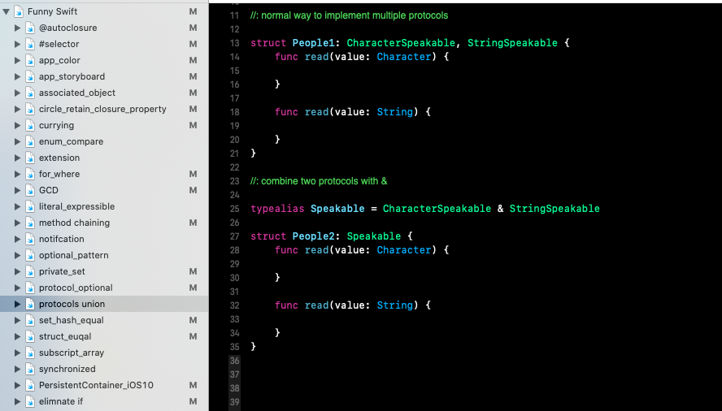
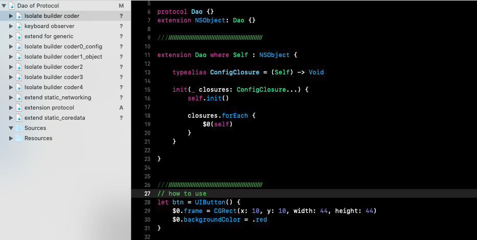

# Swift tips
Some tips about coding in swift efficiently and elegantly.
[Download](https://github.com/TonnyTao/HowSwift/archive/master.zip) two playground files to have fun.

* [Funny Swift](#1-funny-swiftplayground)
* [The Dao of Protocol](#2-the-dao-of-protocolplayground)

## Funny Swift.playground
This playground file has some tips about how to write funny swift which saves your time and fingers.



### Extension for Selector:

```swift
private extension Selector {
    static let btnTapped = #selector(ViewController.btnTapped(btn:))
}

btn.addTarget(self, action: .btnTapped, for: .touchUpInside)
```


### Extension for Notification.Name

```swift
extension Notification.Name {
    static let changed = NSNotification.Name(rawValue: "changed")
}

NotificationCenter.default.post(name: .changed, object: nil)
```

### To eliminate nil check with flatMap

```swift
if city != nil {
    para["city"] = city	
}

```

vs

```
city.flatMap { para["city"] = $0 }
```

### Managing multiple storyboards

```swift
user.storyboard
topic.storyboard
...

let userVC = AppStoryboard.user.viewController(UserViewController.self)

let topicVC = AppStoryboard.topic.viewController("TopicViewController")
```

### Extension reduce repeat code

```swift
let p = CGPoint(x:10, y:10.1)
let r = CGRect(x:10, y:10, width:100, height:100)

//lazy code
let p = CGPoint(10, 10.1)
let r = CGRect(10, 10, 100, 100)
```

### Extension to code in chain style

```swift
let view = UIView()
    .backgroundColor(.white)
    .tag(1)
    ...
```

### Use & to combine protocols

```swift
typealias SpeakAble = SpeakStringAble & SpeakCharacterAble
```

### Array subscripts

```swift
var arr = [1, 2, 3]
arr[[0, 2]] //print [1, 3]
```

---
## The Dao of Protocol.playground
This playground file is about basic Protocol and Protocol Oriented Programming. 



### Isolate builder code

```swift
let btn = UIButton() {
    $0.frame = CGRect(x: 10, y: 10, width: 44, height: 44)
    $0.backgroundColor = .red
    ...
}
```

### Keyboard observer

```swift
final class ViewController: UIViewController {
    ...
    
    override func viewWillAppear(_ animated: Bool) {
        super.viewWillAppear(animated)
        
        addKeyboardObservers()
    }
    
    override func viewWillDisappear(_ animated: Bool) {
        super.viewWillDisappear(animated)
        
        removeKeyboardObservers()
    }
}
```

### Default implementation for Active Record

```swift
extension User: RemoteFetchable { }

User.request(RemoteResouce("api.example.com", "/users", .get),
    success: { data in
        
    },
    failure: { err in
        
    })
```

### Extension for specific generic

```swift
extension Callable where Self.PhoneNumberType : SignedInteger {
    func call() {
        print("this is a number", phone)
    }
}
```

[Read more](/Dao of Protocol.md)

